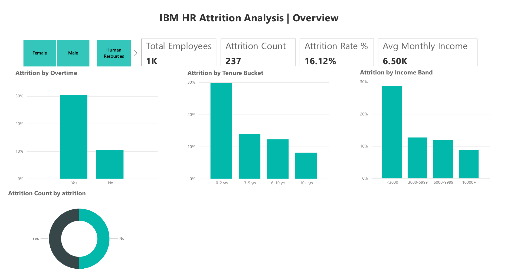
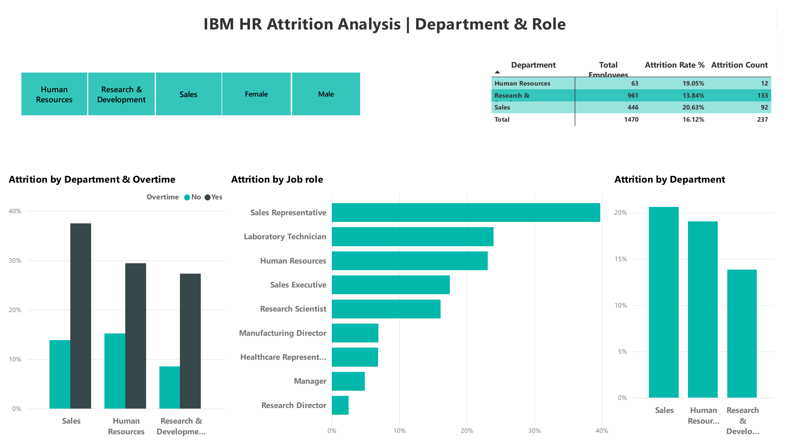
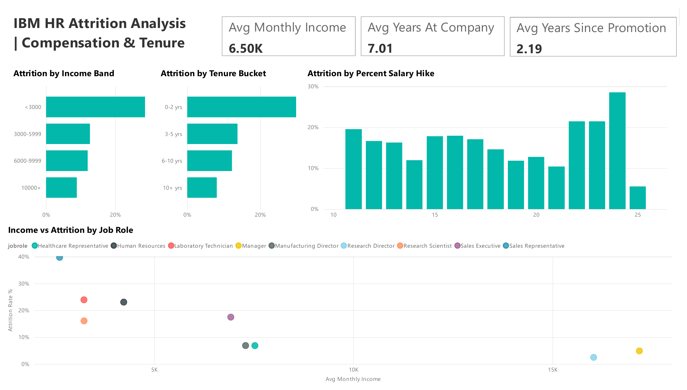
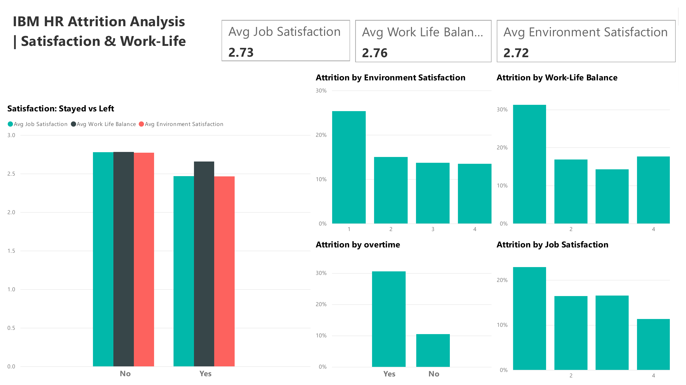
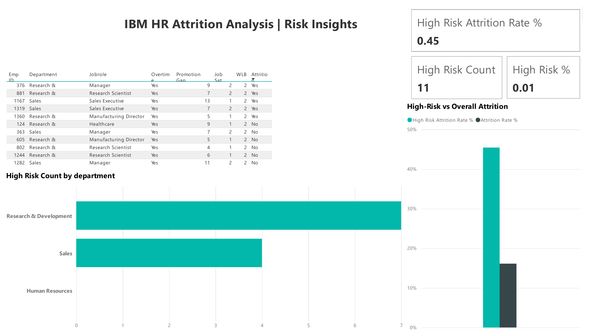

# 📊 IBM HR Attrition Analysis

An end-to-end HR analytics project exploring **why employees leave** — built across **SQL, Excel, and Power BI** using the IBM HR Employee Attrition dataset (1,470 employees, 35 attributes).

---

## 🎯 Project Overview

This project simulates a real-world HR analytics workflow: cleaning and structuring raw data, exploring it with SQL, validating findings in Excel, and delivering an interactive Power BI dashboard for stakeholders.

**Tools used:** PostgreSQL · Microsoft Excel · Power BI · DAX

---

## 🗂️ Data Model

The original flat dataset was normalized into 5 relational tables, joined on `EmployeeID`:

| Table | Description |
|---|---|
| `demographics` | Age, Gender, Department, JobRole, Education, MaritalStatus |
| `employment` | BusinessTravel, OverTime, YearsAtCompany, YearsInCurrentRole, TotalWorkingYears, YearsSinceLastPromotion |
| `compensation` | MonthlyIncome, PercentSalaryHike, StockOptionLevel |
| `satisfaction` | JobSatisfaction, EnvironmentSatisfaction, WorkLifeBalance, JobInvolvement, PerformanceRating |
| `attrition` | Attrition (Yes/No) |

`demographics` acts as the hub table, with 1:1 relationships out to the other four — a clean star-schema structure.

---

## 🧱 Tech Stack & Workflow

### 1. SQL (PostgreSQL)
- Designed schema with primary/foreign keys across all 5 tables
- Wrote 18 analysis queries, tiered from basic aggregates to advanced window functions:
  - Simple: attrition rate, headcount by department, average income by role
  - Intermediate: attrition rate by OverTime/income band/tenure bucket, satisfaction comparisons
  - Advanced: `RANK()`, `NTILE()`, `LAG()`, correlated subqueries, CTEs, and a multi-factor "flight risk" flag
- Built a reusable `employee_full` view joining all 5 tables for downstream tools

### 2. Excel
- Data validation (nulls, duplicates, category consistency)
- Calculated helper columns: `TenureBucket`, `IncomeBand`, `AttritionFlag`
- PivotTables/PivotCharts cross-validating the same insights surfaced in SQL

### 3. Power BI
- Star-schema data model (5 tables, EmployeeID relationships)
- Custom DAX measures: `Attrition Rate %`, `Avg Monthly Income`, `High Risk Employee Count`, and more
- 5-page interactive report:
  1. **Overview** — KPIs, attrition split, headline drivers
  2. **Department & Role** — attrition rate by department/job role, drill-down matrix
  3. **Compensation & Tenure** — income bands, tenure buckets, salary hike, income-vs-attrition scatter
  4. **Satisfaction & Work-Life** — job satisfaction, environment, work-life balance vs attrition
  5. **Risk Insights** — a custom "high flight-risk" flag (OverTime + low satisfaction + no recent promotion) surfaced in a dedicated table and comparison chart

---

## 🖼️ Dashboard Preview

**Overview**


**Department & Role**


**Compensation & Tenure**


**Satisfaction & Work-Life**


**Risk Insights**


---

## 🔑 Key Insights

| Finding | Detail |
|---|---|
| **Baseline attrition rate** | ~16.1% of employees left |
| **OverTime is the single strongest driver** | 30.5% attrition (OverTime = Yes) vs 10.4% (No) |
| **New hires are highest-risk** | 29.8% attrition in the 0–2 year tenure bucket |
| **Low pay compounds risk** | 28.6% attrition in the lowest income band (<$3000/month) |
| **Sales has the highest departmental attrition** | ~20.6%, followed by HR (~19%) and R&D (~13.8%) |
| **High-risk segment** | Employees flagged as high-risk (OverTime + low satisfaction + no recent promotion) leave at roughly **2.8x** the company-wide rate |

---

## 📁 Repository Structure

```
├── data/
│   ├── demographics.csv
│   ├── employment.csv
│   ├── compensation.csv
│   ├── satisfaction.csv
│   └── attrition.csv
├── sql/
│   ├── schema.sql              # Table definitions + foreign keys
│   ├── queries.sql              # Core starter queries + employee_full view
├── excel/
│   └── hr_attrition_analysis.xlsx   # Helper columns + PivotTables
├── powerbi/
│   └── hr_attrition_dashboard.pbix
├── images/
│   ├── page1_overview.png
│   ├── page2_department_role.png
│   ├── page3_compensation_tenure.png
│   ├── page4_satisfaction.png
│   └── page5_risk_insights.png
└── README.md
```

---

## 🚀 How to Reproduce

1. **Load the data:** run `sql/schema.sql` to create the tables, then load each CSV in `data/` in this order (respects foreign keys): `demographics → employment → compensation → satisfaction → attrition`
2. **Run the analysis:** execute `sql/insight_queries.sql` against your database to reproduce every insight above
3. **Open the dashboard:** open `powerbi/hr_attrition_dashboard.pbix` in Power BI Desktop, update the data source connection to your local Postgres instance, and refresh

---

## 📌 Notes

- Dataset source: [IBM HR Analytics Employee Attrition & Performance](https://www.kaggle.com/datasets/pavansubhasht/ibm-hr-analytics-attrition-dataset) (synthetic data created by IBM data scientists)
- `EmployeeNumber` was renamed to `EmployeeID` for clarity and consistency across all three tools

---

*Built as a hands-on project to practice relational data modeling, SQL analysis, and BI dashboard design end-to-end.*
